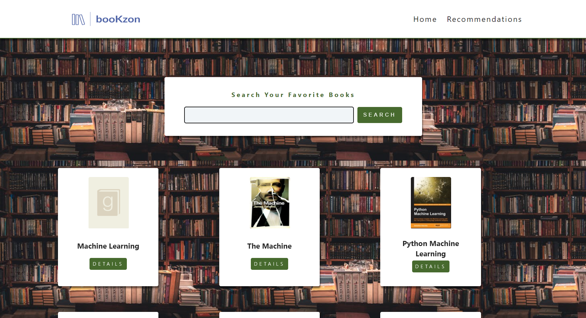
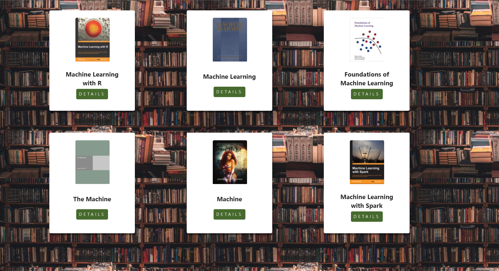
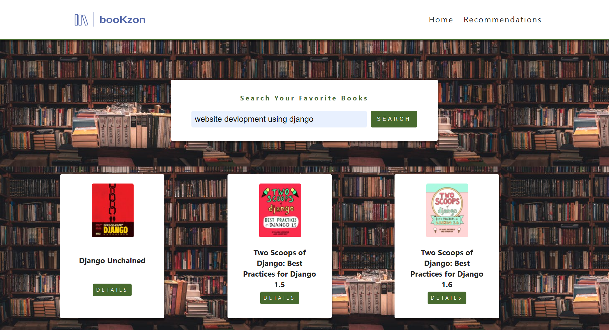
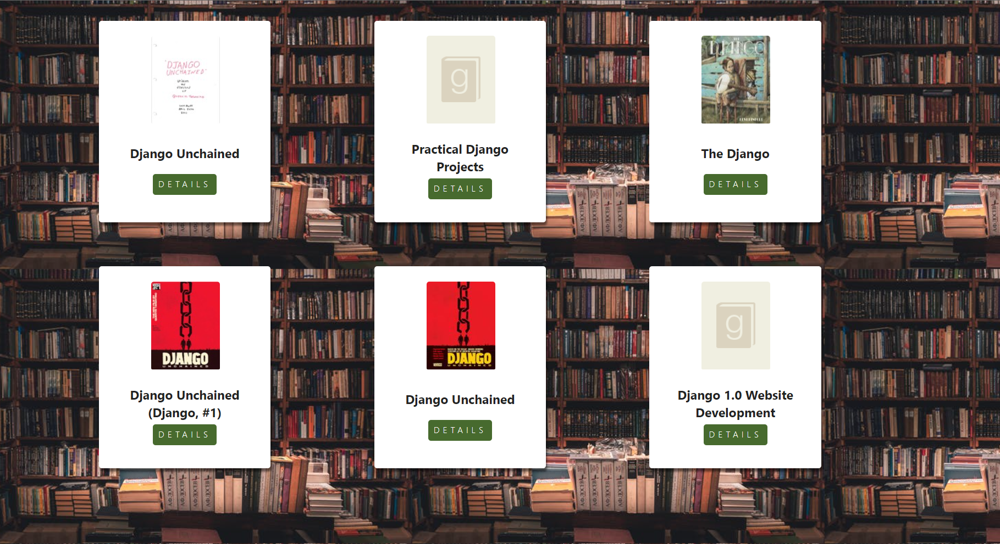
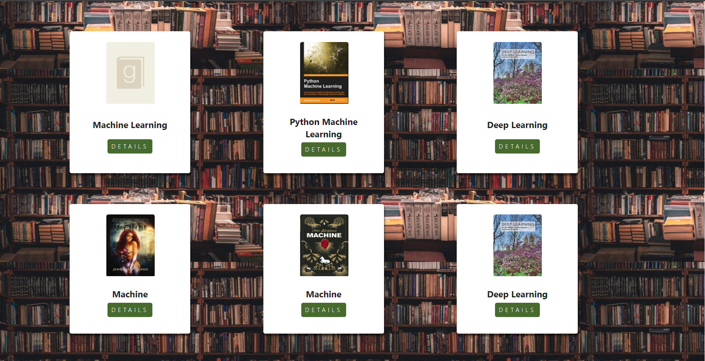

# Search Page

# Recommendation Page

# booKzon
A book recommendation website where you can search your favorite books and based on your search it will recommend you books using K-Nearest Neighbour ML.It uses cookies to store books you search and based on that it will recommend you books.

### Tech Stack 
1. Django(Backend)
2. React(Frontend)

### Datasets
The datasets were collected in late 2017 from goodreads.com, where we only scraped users' public shelves, i.e. everyone can see it on web without login. User IDs and review IDs are anonymized. 

To download data files follow below links:
- [goodreads_books.json.gz](https://drive.google.com/uc?id=1LXpK1UfqtP89H1tYy0pBGHjYk8IhigUK) 
- [goodreads_interactions.csv](https://drive.google.com/uc?id=1zmylV7XW2dfQVCLeg1LbllfQtHD2KUon&export=download)
- [book_id_map.csv](https://drive.google.com/uc?id=1CHTAaNwyzvbi1TR08MJrJ03BxA266Yxr)

Make a folder of name:'Data' in API folder and put these files into it.

### Setup
Run these commands in terminal to run the project:
- `pip install -r requirements.txt` to install backend dependencies
- `cd frontend` to access frontend folder
- `npm install` to intall frontend dependencies
- `npm run build` to build the app for production to the build folder.
- `cd ..` to access root folder
- `python manage.py makemigrations` to make migrations
- `python manage.py migrate` to migrate
- `python manage.py runserver` to run the local server

Then, navigate to http://127.0.0.1:8000/ in your browser
